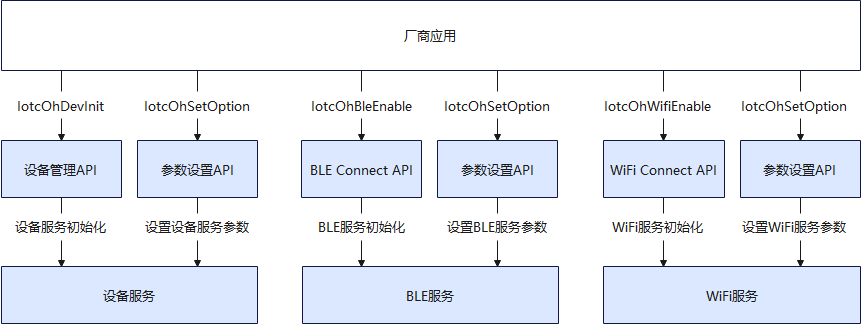
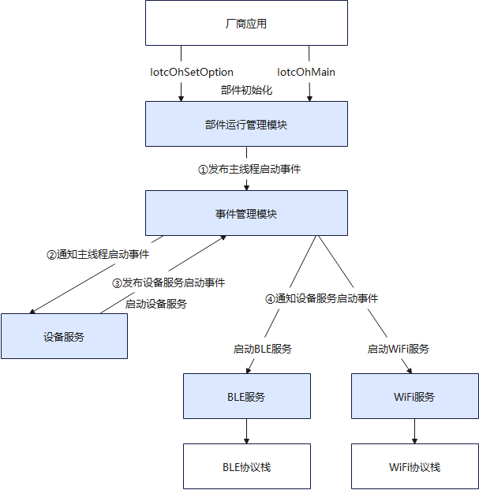
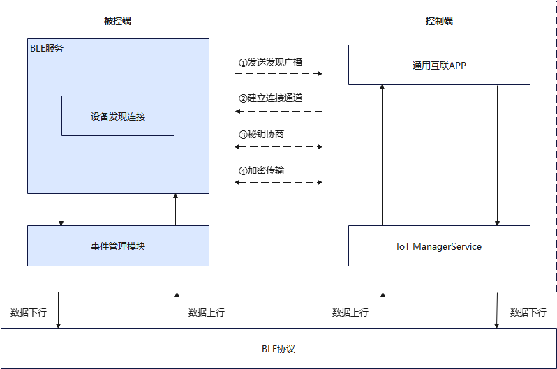
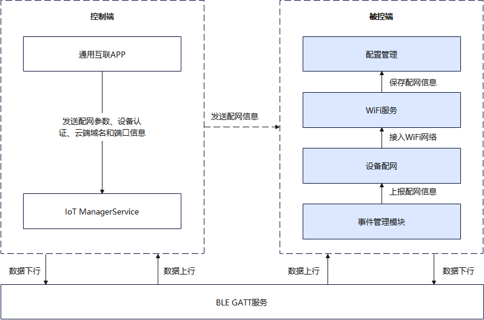
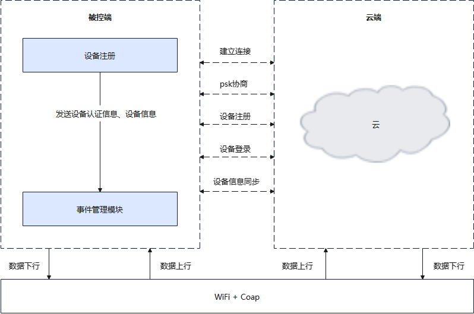
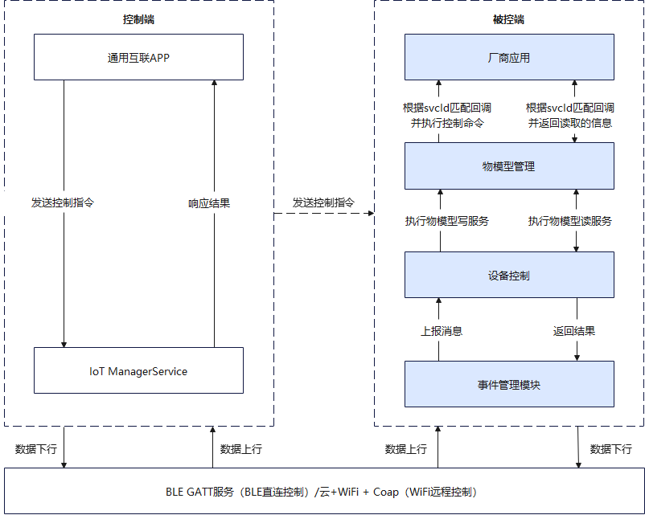
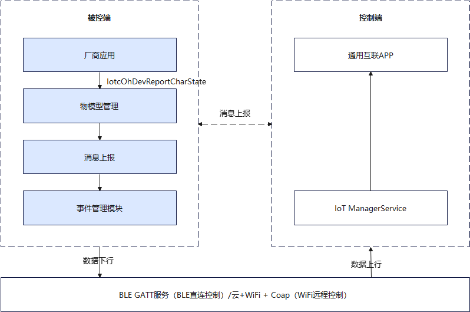

# IoT Connect Component

## Introduction

The IoT Connect component is an ultra-lightweight, high-performance connection control core component specifically built for OpenHarmony resource-constrained mini-class devices. Its core objective is to provide stable, secure, and low-power device access, network communication, and remote control capabilities for devices that are extremely sensitive to computing, storage, and power consumption.

By abstracting the underlying complex network differences, IoT Connect greatly simplifies the development process of IoT devices, providing key technical infrastructure support for building lightweight smart hardware and achieving wide-area access for the Internet of Everything. It serves as a crucial bridge for intelligent collaboration and seamless connectivity between devices.

**Core Features:**

- Multi-form Device Support: Oriented towards OpenHarmony mini-class resource-constrained thin devices, supporting network forms such as **BLE Only, BLE&WiFi Combo**, etc.
- Proximity Discovery and Secure Network Configuration: Provides device proximity discovery, secure network configuration, and network access capabilities.
- Multi-mode Control: Supports **BLE direct connection control and cloud-end control** to achieve side collaboration between devices.

## System Architecture

Unified Connectivity defines and implements a complete set of standard interaction interfaces between general connectivity apps and devices, and between devices and cloud platforms, as shown in the figure below:

<div align="center">
  
  <br>
  <b></b> Figure 1 Unified Connectivity Linkage and Control Network Diagram
</div>

### Interface Description for Unified Connectivity Linkage and Control Network

| **Interface Name** | **Communication Protocol**                         | **Interface Description**                                                                                 |
| -------- | -------------------------------- | ---------------------------------------------------------------------------------------- |
| IF1.1    | BLE Adv Broadcast<br>JSON Over BLE GATT | General connectivity app communication interface with BLE devices, used for device discovery, connection, network configuration, and BLE direct connection control.                                                  |
| IF2.1    | Coap Over TLS <br>Coap Over TCP  | WiFi device and cloud communication interface in resource-unconstrained scenarios, used for device registration, login, control, with transport layer encryption required. WiFi device and cloud communication interface in resource-constrained scenarios, used for device registration, login, control, with application layer encryption required. |
| IF3.1    | HTTPS MQTT                       | General connectivity app and cloud communication interface. Cloud pushes messages to general connectivity app interface                                                          |

<div align="center">
Table 1 Interface Description for Unified Connectivity Linkage and Control Network
</div>

### IoT Connect Component Architecture

<div align="center">
  
  <br>
  <b></b> Figure 2 IoT Connect Component Architecture
</div>

### Module Function Description

The overall architecture is divided into Application Layer, Framework Layer, Service Layer, and Hardware Interface Adaptation Layer.

#### Application Layer

System applications developed by device manufacturers, responsible for calling interfaces provided by the IoT Connect component to execute business logic, such as starting the component, starting BLE service, information reporting, etc.

#### Framework Layer

Used to provide standardized calling interfaces to the application layer, including component operation, BLE Connect, WiFi Connect, and device management interface capabilities.

**Component Operation**
Responsible for providing external interfaces related to component startup, reset, stop, and other component operations, as well as component operation parameter configuration interfaces.

**Device Management**
Responsible for providing external interfaces for device initialization, device information configuration, thing model service callback registration, and service proactive reporting.

**BLE Connect**
Responsible for providing external interfaces that enable device discovery, network configuration, and control capabilities based on BLE protocol.

**WiFi Connect**
Responsible for providing external interfaces that enable device registration, connection, and control capabilities based on WiFi protocol.

#### Service Layer

The service layer implements the core IoT business logic, divided into **Component Operation Management, Configuration Management, Thing Model Management, Device Control, Message Reporting, Device Discovery and Connection, Device Network Configuration, Device Registration, and Event Management Module** 9 sub-modules.

**Component Operation Management**

Responsible for component thread startup and exit control, component operation parameter settings, and factory reset of the component.

**Configuration Management**

Manages device information and WiFi configuration parameters registered by vendor applications.

**Thing Model Management**

The thing model of a product contains multiple services. For example, a light switch and brightness are two services. Turning the light on/off and setting brightness are write commands (control commands), and getting brightness is a read command.
The thing model module is responsible for maintaining thing model services registered by device vendor applications, checking the legitimacy of commands sent by the control end, and transmitting execution information from the transparent control module to device vendor applications.

**Device Discovery and Connection**

Sends wireless broadcasts through the BLE service, enabling the device to be scanned and discovered by the general connectivity app.
The user operates the general connectivity app to connect to the controlled device. Both parties authenticate through PIN code and negotiate encryption keys through SPEKE, completing encrypted data transmission.

**Device Network Configuration**

For hardware devices supporting WiFi protocol, BLE-assisted network configuration is used. After the general connectivity app connects to the device BLE, it sends WiFi network configuration parameters to the device. After the device connects to the WiFi router, it stops BLE broadcasting.

**Device Registration**

After the device connects to WiFi, it establishes a connection with the cloud through the CoAP protocol, completing PSK negotiation authentication, device information registration, and device login.

**Device Control**

The control end sends commands to the controlled device via BLE direct connection or cloud remote method. After receiving commands, the controlled device executes corresponding business, including reading information and executing control commands.

**Message Reporting**

Device vendor applications report device status, device events, and other information to the cloud and control devices through interfaces provided by the component.

**Event Management Module**

Used for decoupled communication between modules, uniformly distributing notifications of device, BLE, and WiFi service event changes, handling scheduled tasks, heartbeat keep-alive, timeout retransmission management, and asynchronous task scheduling to avoid blocking business processes.

#### Hardware Interface Adaptation Layer

The lightweight Bluetooth and WiFi subsystems provide unified standard interfaces, adapted by BLE/WiFi chip module manufacturers, providing communication capabilities for IoT Connect component business.

### Key Interaction Flows

The IoT Connect component adopts a layered design of first registration declaration ---> then binding implementation ---> finally execution startup, decoupling devices and components without interference.
To more clearly show how modules collaborate, the following details core processes.

#### Component Initialization

Device service, BLE service, and WiFi service modules register and declare with the component, and the vendor application's implementation binds and maps with the device service module's declaration.

<div align="center">
  
  <br>
  <b></b> Figure 3 Component Initialization
</div>

- **Device Service Module Initialization**:
  - When `Vendor Application` calls `IotcOhDevInit`, the device service module performs the following registration without executing:
    - Register service callback list declarations with the component, including thing model query callback, thing model control callback, thing model service reporting callback, device information configuration, component restart callback, etc. APP binds declarations with APP callback functions through the `IotcOhSetOption` interface.
    - Register device service module initialization and deinitialization entry functions with the component.
- **BLE Service Module Initialization**:
  - When `Vendor Application` calls `IotcOhBleEnable` as needed, the BLE service module performs the following registration without executing:
    - Register service callback list declarations with the component, including device network configuration callback declaration, broadcast duration configuration, etc.
    - Register BLE service module initialization and deinitialization entry functions with the component.
- **WiFi Service Module Initialization**:
  - When `Vendor Application` calls `IotcOhWifiEnable` as needed, the WiFi service module performs the following registration without executing:
    - Register service callback list declarations with the component, including network configuration mode, network configuration timeout duration, etc.
    - Register WiFi service module initialization and deinitialization entry functions with the component.

#### Component Startup

<div align="center">
  
  <br>
  <b></b> Figure 4 Component Startup
</div>

- **Set Runtime Parameters**:
  - `Vendor Application` can call the `IotcOhSetOption` interface to set runtime parameters as needed. If not set, default parameters are used. Parameters include log level, thread stack size, configuration file directory, etc.
- **Start Main Thread**:
  - When `Vendor Application` calls `IotcOhMain`, the component initializes based on runtime parameters, then executes initialization functions registered by device service module, BLE service module, and WiFi service module, creates device service instance, BLE service instance, WiFi service instance, starts the component main thread, and publishes main thread startup event.
- **Start Device Service**:
  - After the device service instance receives the main thread startup event, it starts the device service and publishes the device service startup event.
- **Start BLE/WiFi Service**:
  - After BLE/WiFi service instance receives the device service startup event, it starts the BLE/WiFi service.
    BLE Service: Initialize BLE protocol stack, register GATT service for communication with control end, send device discovery broadcast, etc.
    WiFi Service: Initialize WiFi protocol stack, start Coap service for communication with control end or cloud.

#### Device Discovery and Connection

The general connectivity app implements device discovery and connection with the controlled device through BLE protocol, as follows:

<div align="center">
  
  <br>
  <b></b> Figure 5 BLE Device Discovery
</div>

- **Send Broadcast**:
  - In factory state or factory reset state, BLE device powers on with Advertising broadcast enabled by default. Broadcast data contains device type, manufacturer name, and other information.
- **Discovery and Connection**:
  - User scans and discovers device through control end `General Connectivity App`, and displays scanned device on the `General Connectivity App` interface.
  - User clicks to connect to the controlled device, establishing a connection channel through BLE protocol.
  - Key negotiation and encrypted transmission: User manually inputs PIN code in `General Connectivity App`. Both parties perform SPEKE session key negotiation through the obtained PIN code to generate encryption key, and subsequent data interaction uses the negotiated key for encrypted transmission. For details, please refer to: [Security Negotiation Process](https://gitee.com/link?target=https://gitcode.com/ohos-oneconnect/specification/blob/master/OpenHarmony%E8%AE%BE%E5%A4%87%E7%BB%9F%E4%B8%80%E4%BA%92%E8%81%94%20%E6%8E%A5%E5%85%A5%E4%B8%8E%E6%8E%A7%E5%88%B6%E6%8E%A5%E5%8F%A3%E6%8A%80%E6%9C%AF%E8%A7%84%E8%8C%83.md#623-speke-over-ble%EF%BC%88ble%E8%AE%BE%E5%A4%87%E3%80%81wi-fible-combo%E8%AE%BE%E5%A4%87%EF%BC%89)

#### Device Network Configuration

BLE-assisted device access to WiFi network.

<div align="center">
  
  <br>
  <b></b> Figure 6 BLE Device Assisted Network Configuration
</div>

- **Get Device Registration Verification Code and PSK Information**:
  - General connectivity app logs in to the cloud and gets device registration verification code and PSK information.

- **Send Network Configuration Information**:
  - General connectivity app sends WiFi network configuration information (SSID/password), authentication information, and cloud domain name and port information to the controlled device.

- **Execute Network Configuration**:
  - After the controlled device's network configuration module receives the message, it connects to the home network based on network configuration parameters (WiFi SSID and password), broadcasts network configuration success message, and caches network configuration information.

#### Device Registration

<div align="center">
  
  <br>
  <b></b> Figure 7 Device Registration
</div>

The device registration process implements secure communication between the device and cloud service, including end-cloud connection establishment, PSK negotiation, device registration, and device login.

- **Network Ready Check**:
  - After the controlled device completes network configuration and connects to WiFi, it periodically checks device status. When the device is ready, it starts connecting to the cloud.
- **End-Cloud Connection**:
  - Controlled device reads the cloud domain name and port sent during network configuration and establishes connection with the cloud.
  - In resource-unconstrained scenarios, the controlled device establishes TLS connection with the cloud for device registration, login, control, with transport layer encryption.
  - In resource-constrained scenarios, the controlled device establishes TCP connection with the cloud for device registration, login, control, with application layer encryption required.
- **PSK Negotiation**:
  - Controlled device sends random number sn1 and devId to the cloud.
  - Cloud receives sn1, generates random number sn2, uses sn1, sn2, and password to generate PskInfo, and responds sn2 to the controlled device.
  - Controlled device receives sn2, similarly generates PskInfo through sn1, sn2, and password (already sent to controlled device by APP during network configuration).
- **Device Registration**:
  - Controlled device sends device authentication code (already sent to controlled device during network configuration by APP) and device information to the cloud.
  - Cloud verifies device authentication code, completes device information registration, and returns verification result and security code.
  - After successful registration, controlled device persistently saves pskInfo, cloud url, security code, etc. After subsequent device restart, registration is not performed again. This information is directly read for device login.
- **Device Login**:
  - Controlled device sends devId and security code to the cloud.
  - After cloud verifies security code, it generates access token and sends it to the control end.
  - Control end caches token for subsequent interaction.
- **Device Information Synchronization**:
  - After successful login, controlled device sends the latest device information and thing model service information to the cloud. Device changes to `ONLINE` status, and end-cloud connection process is complete.

#### Device Control

After the control end and controlled device establish a connection, the control end sends commands to control the controlled device via BLE GATT/cloud method.

<div align="center">
  
  <br>
  <b></b> Figure 8 Device Control
</div>

The device control process supports multi-channel control capabilities, including cloud remote control (WiFi+Coap) and BLE point-to-point control, providing unified device service state management.

- Control Command Processing Flow
1. **Command Reception**:
   - General connectivity app sends control commands to the controlled device via cloud remote or BLE direct connection. The content includes service ID (svcId) and control data (JSON format).
   - Controlled device receives command information via BLE GATT or WiFi+Coap protocol. The event bus transparently transmits data to the upper layer to the `Device Control` module.
2. **Command Execution**:
   - `Device Control` calls thing model write service. Thing model parses and encapsulates data, and passes it to the APP-bound write service callback function.
   - `General Connectivity App` finds the corresponding thing model service according to svcId, executes, and updates device status.
- Query Command Processing Flow
1. **Command Reception**:
   - `General Connectivity App` sends query command to the controlled device via cloud remote or BLE direct connection. The content must include service ID (svcId).
   - Controlled device receives command information via BLE GATT or WiFi+Coap protocol. The event bus transparently transmits data to the upper layer to the `Device Control` module.
2. **State Acquisition**:
   - `Device Control` calls thing model read service. Thing model parses and encapsulates data, and passes it to the `Vendor Application` bound read service callback function.
   - `Vendor Application` finds the corresponding thing model service according to svcId and returns the service execution result.
3. **Response Return**:
   - `Vendor Application` returns status data in JSON format (such as `{"on":1, "brightness":80}`).
   - Data is encrypted and passed to the control end.

#### Message Reporting

`Vendor Application` can proactively report messages to the cloud and general connectivity app via `IotcOhDevReportCharState`, such as device status changes and events.

<div align="center">
  
  <br>
  <b></b>Figure 9 Message Reporting
</div>

- Message Reporting Processing Flow
  - `Vendor Application` can proactively report status changes via `IotcOhDevReportCharState`.
  - Message data is encrypted and sent to the control end.

## Directory

```
//foundation/communication/iot_connect
├── adapter                 # Adaptation layer code (OS/Bluetooth/WiFi)
├── core                    # Core code
│   ├── ble                 # BLE discovery and network configuration code
│   ├── wifi                # Wi-Fi discovery, network configuration, and end-cloud connection code
│   ├── device              # Device control and registration information management code
│   └── infrastructure      # Core infrastructure code (security/log/event, etc.)
├── interfaces              # External interface code
│   └ kits/common          # Common interface definitions (error codes/events/configuration, etc.)
│   └ kits/oh_connect      # OpenHarmony integration interface
├── sdk                     # Solution business entry code
├── test                    # Test code
├── tools                   # Tool code
└── docs                    # Documentation directory
```

## Build Instructions

###裁剪指导

Depending on the scenario, there are two types: BLE only and BLE&WiFi Combo.
For BLE only scenario, just configure the `iot_connect_ble_support` macro to true.
For BLE&WiFi Combo scenario, configure both `iot_connect_ble_support` and `iot_connect_wifi_support` macros to true.

### Memory Information:

| **Scenario**         | **ROM** | **RAM** |
| -------------- | ------- | ------- |
| BLE            | 70KB    | 13KB    |
| BLE&WiFi Combo | 130KB   | 25KB    |

<center>Table 2 Memory Information</center>

### Build

For different target platforms, use the following commands to build:

**Build iot_connect component for 32-bit ARM system**

```bash
bash build/prebuilts_download.sh           # Prebuild
hb set      # Select mini, then continue to select corresponding product, such as dk_3863
hb build                                     # Build
```

## Usage Instructions

### IoT Connect Component Interface Description

#### Component Operation

| Function Prototype                                          | Core Function Description                                                   |
| --------------------------------------------- | -------------------------------------------------------- |
| int32_t IotcOhMain(void)                      | Component business entry. After calling, it pulls up its own task thread. Most pre-configuration interfaces are no longer available.                         |
| int32_t IotcOhReset(void)                     | Component reset. After calling, the component will reset all component business running states. Only valid when the component is running. This interface is synchronous. Return indicates reset success/failure. |
| int32_t IotcOhStop(void)                      | Stop the component from running. Only valid when the component is running. This interface is synchronous. Return indicates stop success/failure.                  |
| int32_t IotcOhRestore(void)                   | Notify all services to restore factory settings. Only valid when the component is running. This interface is synchronous. Return indicates factory restore success/failure.             |
| int32_t IotcOhSetOption(int32_t option, ...); | Configure runtime parameters for the component. `option` is the parameter type to be configured. It needs to be used with corresponding configuration options.                   |

#### BLE Connect

| Function Prototype                                                                                                                  | Core Function Description                                                                                                                     |
| --------------------------------------------------------------------------------------------------------------------- | -------------------------------------------------------------------------------------------------------------------------- |
| int32_t IotcOhBleEnable(void)                                                                                         | Enable BLE discovery, connection, and control capabilities. This interface only enables. Calling it does not trigger any business process. It should be called before iot connect runs.                                                                   |
| int32_t IotcOhBleDisable(void)                                                                                        | Disable iot connect's BLE discovery, connection, and control capabilities. Used to release resources applied when calling `IotcOhBleEnable`. Cannot be called when iot connect is running.                                               |
| int32_t IotcOhBleStartAdv(uint32_t ms);                                                                               | Start BLE broadcast discovery. Depending on different initialization parameters, iot connect will automatically send broadcasts for a period of time after startup. Subsequent calls to this interface activate broadcast. Used to cooperate with external buttons to implement button-triggered scenarios. `ms` is broadcast duration (unit: ms). GATT connection does not refresh or extend this time.               |
| int32_t IotcOhBleStopAdv(void)                                                                                        | During BLE broadcast discovery, calling this interface can stop broadcast.                                                                                                     |
| int32_t IotcOhBleSendCustomSecData(const uint8_t *data, uint32_t len);                                                | In some scenarios, used to send data through the customSecData service channel. SDK completes data encryption and sends to the peer. `data` is data to be sent, `len` is data length.                                                        |
| int32_t IotcOhBleSendIndicateData(const char *svcUuid, const char *charUuid, const uint8_t *value, uint32_t valueLen) | When using component-managed GATT service, used to send BLE Indicate data. `svcUuid` is BLE GATT service UUID, `charUuid` is BLE GATT service character UUID, `value` is data to be sent, `valueLen` is data length. |
| int32_t IotcOhBleRelease(void)                                                                                        | BLE resource release. Used to release resources applied when calling `IotcOhBleEnable`. This interface is called when iot connect is running.                                                                   |

#### Wi-Fi Connect

| Function Prototype                            | Core Function Description                                                                          |
| ------------------------------- | ------------------------------------------------------------------------------- |
| int32_t IotcOhWifiEnable(void)  | Enable discovery, connection, and control capabilities based on Wi-Fi/LAN. This interface only enables. Calling it does not trigger any business process. It should be called before iot connect runs.               |
| int32_t IotcOhWifiDisable(void) | Disable iot connect's Wi-Fi discovery, connection, and control capabilities. Used to release resources applied when calling `IotcOhWifiEnable`. Cannot be called when iot connect is running. |

#### Device Management

| Function Prototype                                                                        | Core Function Description                                                                                 |
| --------------------------------------------------------------------------- | -------------------------------------------------------------------------------------- |
| int32_t IotcOhDevInit(void)                                                 | Configure device information and register device service/control and other related business callbacks. This interface should be called before iot connect runs.                                         |
| int32_t IotcOhDevDeinit(void)                                               | Release resources applied when calling `IotcOhDevInit`. This interface cannot be called when iot connect is running.                                         |
| int32_t IotcOhDevReportCharState(const IotcCharState state[], uint32_t num) | Report device service information. Should be called when device service information changes or event service occurs. `state` is the list of services to report (should be a constant pointer, see `IotcCharState` struct definition), `num` is the number of services to report. |

### Southbound Interface

IoT Connect calls standard interfaces of OpenHarmony lightweight Bluetooth and WiFi subsystems, implemented by chip module manufacturers.

Lightweight Bluetooth: [Lightweight Bluetooth System Usage Guide](https://gitcode.com/ohos-oneconnect/communication_bluetooth#%E8%BD%BB%E9%87%8F%E6%88%96%E5%B0%8F%E5%9E%8B%E7%B3%BB%E7%BB%9F%E4%BD%BF%E7%94%A8%E8%AF%B4%E6%98%8E)

Lightweight WiFi: [Lightweight WiFi System Usage Guide](https://gitcode.com/ohos-oneconnect/communication_wifi_lite)

The following are interfaces that IoT Connect depends on:

#### BLE Interface

| Function Prototype                                                                                | Core Function Description         |
| ----------------------------------------------------------------------------------- | -------------- |
| int InitBtStack(void)                                                               | Initialize Bluetooth protocol stack       |
| int EnableBtStack(void)                                                             | Enable Bluetooth protocol stack        |
| int DisableBtStack(void)                                                            | Disable Bluetooth protocol stack       |
| int SetDeviceName(const char *name, unsigned int len)                               | Set Bluetooth device name       |
| int ReadBtMacAddr(unsigned char *mac, unsigned int len)                             | Read Bluetooth MAC address      |
| int BleGattsRegisterCallbacks(BtGattServerCallbacks *func)                          | Register GATT server callback    |
| int BleGattRegisterCallbacks(BtGattCallbacks *func)                                 | Register GATT client callback    |
| int BleGattsStartServiceEx(int *srvcHandle, BleGattService *srvcInfo)               | Start GATT service       |
| int BleGattsDeleteService(int serverId, int srvcHandle)                             | Delete GATT service       |
| int BleGattsUnRegister(int serverId)                                                | Unregister GATT server      |
| int BleGattsSendIndication(int serverId, GattsSendIndParam *param)                  | Send Indication notification |
| int BleGattsDisconnect(int serverId, BdAddr bdAddr, int connId)                     | Disconnect GATT connection       |
| int BleGattsSetEncryption(BdAddr bdAddr, BleSecAct secAct)                          | Set connection encryption type       |
| int BleStartAdvEx(int *advId, const StartAdvRawData rawData, BleAdvParams advParam) | Start BLE broadcast        |
| int BleStopAdv(int advId)                                                           | Stop BLE broadcast        |
| int BleSetSecurityAuthReq(BleAuthReqMode mode)                                      | Bluetooth security authentication setting       |
| int BleGattSecurityRsp(BdAddr bdAddr, bool accept)                                  | Security response           |

#### WiFi Interface

| Function Prototype                                                           | Core Function Description        |
| -------------------------------------------------------------- | ------------- |
| int EnableWifi()                                               | Enable WiFi        |
| int DisableWifi()                                              | Disable WiFi        |
| int IsWifiActive()                                             | Check if WiFi is enabled    |
| int GetDeviceConfigs(WifiDeviceConfig *config, uint32_t *size) | Get WiFi configuration information    |
| int AddDeviceConfig(WifiDeviceConfig *config, int *netId)      | Add WiFi network configuration    |
| int RemoveDevice(int netId)                                    | Remove WiFi network configuration    |
| int ConnectTo(int networkId)                                   | Connect to WiFi with specified network ID |
| int Disconnect()                                               | Disconnect WiFi connection      |
| int AdvanceScan(const WifiScanParams *params)                  | Start WiFi scan      |
| int GetScanInfoList(WifiScanInfo *result, uint32_t *size)      | Get scan result list      |
| int GetLinkedInfo(WifiLinkedInfo *info)                        | Get current WiFi connection information  |
| int RegisterWifiEvent(const WifiEvent *event)                  | Register WiFi event callback    |
| int IsHotspotActive()                                          | Check if hotspot is enabled      |
| int EnableHotspot()                                            | Enable hotspot          |
| int DisableHotspot()                                           | Disable hotspot          |
| int SetHotspotConfig(const HotspotConfig *config)              | Configure hotspot parameters        |
| int GetStationList(StationInfo *info, uint32_t *size)          | Get connected STA information    |
| int DisassociateSta(unsigned char *mac, int lenMac)            | Force disconnect specified STA connection   |
| int AddTxPowerInfo(int power)                                  | Set hotspot transmit power      |
| int GetDeviceMacAddress(unsigned char *result)                 | Get device MAC address     |
| int GetIpInfo(IpInfo &info)                                    | Get IP information        |

### Development Steps

**Note:** The following demonstrates the complete process for developing IoT Connect, including controller APP installation and deployment, cloud platform deployment, controlled device capability enablement, parameter configuration, device discovery, data interaction, and resource release (using BLE/Wi-Fi Combo as example code).

#### Controller End

The controller end is responsible for APP installation and deployment, cloud platform deployment, cloud communication, and control command distribution.

| Item                   | Description                      | Link                                                                                              |
| -------------------- | ----------------------- | ----------------------------------------------------------------------------------------------- |
| General Connectivity App              | Control core entry, running on HOS phone        | [General Connectivity App](https://gitcode.com/ohos-oneconnect/docs/blob/master/zh-cn/设备联动与控制/通用互联APP/README.md) |
| IoTManagementService | Device management service component on OpenHarmony device | [IoTManagementService](https://gitcode.com/ohos-oneconnect/IoTManagementService)                |

#### Cloud Platform

| Item  | Description                    | Link                                                                                      |
| --- | --------------------- | --------------------------------------------------------------------------------------- |
| Cloud Platform | Interconnection cloud service, providing account, device, and scenario management | [Cloud Platform](https://gitcode.com/ohos-oneconnect/docs/blob/master/zh-cn/设备联动与控制/云平台/README.md) |

#### Controlled End

The controlled end needs to integrate the IoT Connect component, implementing device information configuration, control callback processing, authentication callback registration, and other functions.

| Platform     | Suite Type           | Development Guide                                                        |
| ------ | -------------- | ----------------------------------------------------------- |
| Hi3863 | BLE only       | [ble_only_hi3863.md](./docs/ble_only_hi3863.md)             |
| Hi3863 | WiFi/BLE Combo | [wifi_ble_combo_hi3863.md](./docs/wifi_ble_combo_hi3863.md) |

#### IoT Connect Component Usage Examples

**Example 1: BLE Only Point-to-Point Control**

Device is discovered by APP via BLE broadcast. After APP connects to the device, it sends control commands (such as turn on/off light). Device executes and reports status.

**Development Steps**

1. **Configure Device Basic Information**: Configure basic information such as product ID and manufacturer ID.

2. **Map Thing Model Services**: Such as switch service, etc.

3. **Implement Control Callbacks**: Such as control command reception and status query.

4. **Implement Authentication Callback Method**: Network configuration authentication processing.

5. **Start Component**: Enable each module capability and start component.

6. **Event Listening**: Listen for Bluetooth broadcast and other events.

**Step 1: Configure Device Basic Information**

```c
#include "iotc_oh_device.h"
#include "iotc_oh_ble.h"
#include "iotc_prof_def.h"

// Device information (must match cloud platform registration information)
static const IotcDeviceInfo DEV_INFO = {
    .sn = "FFEE3333",          // Device serial number
    .prodId = "00007",         // Product ID
    .subProdId = "",           // Sub-product ID
    .model = "PD31",           // Device model
    .devTypeId = "1007",       // Device type ID
    .devTypeName = "TabletPD31",
    .manuId = "104",           // Manufacturer ID
    .manuName = "OpenValley",
    .devName = "OneConnectName",
    .fwv = "1.0.0",
    .hwv = "1.0.0",
    .swv = "1.0.0",
    .protType = IOTC_PROT_TYPE_BLE,  // BLE single mode
};

// Network configuration PIN code (input when APP configures network)
static const char *PIN_CODE = "01234567";
```

**Step 2: Map Thing Model Services**

```c
// Define service list (must match cloud platform thing model)
static const IotcServiceInfo SVC_INFO[] = {
    {"switch", "switch"},    // Switch service
};

// Service handler function mapping table
typedef int32_t (*PutCharStateFunc)(const IotcServiceInfo *svc, const char *data, uint32_t len);
typedef int32_t (*GetCharStateFunc)(const IotcServiceInfo *svc, char **data, uint32_t *len);

typedef struct {
    const IotcServiceInfo *svc;
    PutCharStateFunc putCharState;
    GetCharStateFunc getCharState;
} SvcMapEntry;

// Register handler functions for switch service
SvcMapEntry g_svcMap[] = {
    {&SVC_INFO[0], SwitchPutCharState, SwitchGetCharState},
};
```

**Step 3: Implement Control Callbacks**

```c
// Global state variable
static bool g_switch = false;  // false=light off, true=light on

// 1. Control command reception (called when APP sends command)
int32_t SwitchPutCharState(const IotcServiceInfo *svc, const char *data, uint32_t len)
{
    (void)svc;
    if (data == NULL || len == 0) { return -1; }

    // Parse JSON: {"on":1} or {"on":0}
    cJSON *json = cJSON_Parse(data);
    if (json == NULL) { return -1; }

    cJSON *item = cJSON_GetObjectItem(json, "on");
    if (item == NULL || !cJSON_IsNumber(item)) {
        cJSON_Delete(json);
        return -1;
    }

    int32_t on = cJSON_GetNumberValue(item);
    g_switch = (on == 1);

    // Control GPIO (Example: GPIO5 outputs high/low level)
    IoTGpioSetOutputVal(LED_GPIO, g_switch ? 1 : 0);

    cJSON_Delete(json);
    return 0;
}

// 2. Status query (called when APP queries status)
int32_t SwitchGetCharState(const IotcServiceInfo *svc, char **data, uint32_t *len)
{
    (void)svc;
    if (data == NULL || *data != NULL) { return -1; }

    // Build JSON: {"on":0} or {"on":1}
    cJSON *json = cJSON_CreateObject();
    if (json == NULL) { return -1; }

    cJSON_AddNumberToObject(json, "on", g_switch ? 1 : 0);
    *data = cJSON_PrintUnformatted(json);
    *len = strlen(*data);

    cJSON_Delete(json);
    return (*data != NULL) ? 0 : -1;
}

// 3. Full status reporting (called when device comes online)
int32_t ReportAll(void)
{
    // Get switch service status
    char *jsonStr = NULL;
    uint32_t jsonLen = 0;
    SwitchGetCharState(&SVC_INFO[0], &jsonStr, &jsonLen);

    IotcCharState states[1] = {0};
    states[0].svcId = "switch";
    states[0].data = jsonStr;
    states[0].len = jsonLen;

    int32_t ret = IotcOhDevReportCharState(states, 1);
    cJSON_free(jsonStr);
    return ret;
}
```

**Step 4: Implement Authentication Callback Method**

```c
// PIN code acquisition (network configuration authentication)
int32_t GetPincode(uint8_t *buf, uint32_t bufLen)
{
    if (buf == NULL || bufLen < IOTC_PINCODE_LEN) { return -1; }
    (void)memcpy_s(buf, bufLen, PIN_CODE, IOTC_PINCODE_LEN);
    return 0;
}

// Memory release callback
void DataFree(void *ptr)
{
    if (ptr != NULL) { cJSON_free((char *)ptr); }
}
```

**Step 5: Start Component (Entry Function)**

```c
int32_t IotcOhDemoEntry(void)
{
    int32_t ret;

    // 1. Initialize device management module (must be called first)
    ret = IotcOhDevInit();
    if (ret != 0) { return ret; }

    // 2. Enable BLE module
    ret = IotcOhBleEnable();
    if (ret != 0) { return ret; }

    // 3. Register control callbacks
    SET_OH_SDK_OPTION(ret, IOTC_OH_OPTION_DEVICE_PUT_CHAR_STATE_CALLBACK, PutCharState);
    SET_OH_SDK_OPTION(ret, IOTC_OH_OPTION_DEVICE_GET_CHAR_STATE_CALLBACK, GetCharState);
    SET_OH_SDK_OPTION(ret, IOTC_OH_OPTION_DEVICE_REPORT_ALL_CALLBACK, ReportAll);
    SET_OH_SDK_OPTION(ret, IOTC_OH_OPTION_DEVICE_GET_PINCODE_CALLBACK, GetPincode);
    SET_OH_SDK_OPTION(ret, IOTC_OH_OPTION_DEVICE_GET_AC_KEY_CALLBACK, GetAcKey);
    SET_OH_SDK_OPTION(ret, IOTC_OH_OPTION_DEVICE_DATA_FREE_CALLBACK, DataFree);

    // 4. Configure device and service information
    SET_OH_SDK_OPTION(ret, IOTC_OH_OPTION_DEVICE_DEV_INFO, &DEV_INFO);
    SET_OH_SDK_OPTION(ret, IOTC_OH_OPTION_DEVICE_SVC_INFO, SVC_INFO, 1);

    // 5. Configure BLE broadcast parameters (never timeout)
    SET_OH_SDK_OPTION(ret, IOTC_OH_OPTION_BLE_START_UP_ADV_TIMEOUT, (1000 * 60 * 1000));

    // 6. Register event listener
    SET_OH_SDK_OPTION(ret, IOTC_OH_OPTION_SDK_CONFIG_PATH, "/data/app/iotc");
    SET_OH_SDK_OPTION(ret, IOTC_OH_OPTION_SDK_REG_EVENT_LISTENER, DemoEventListener);

    // 7. Start component (configuration interfaces are no longer available after startup)
    ret = IotcOhMain();
    return ret;
}
```

**Step 6: Event Listening**

```c
void DemoEventListener(int32_t event)
{
    switch (event) {
        case IOTC_CORE_COMM_EVENT_MAIN_INITIALIZED:      // Component initialization complete
        case IOTC_CORE_BLE_EVENT_GATT_DISCONNECT:       // Connection disconnected
            IotcOhBleStartAdv(0);  // Restart broadcast
            break;
        default:
            break;
    }
}
```

**Example 2: BLE&WiFi Combo Network Configuration Control**

Device supports both BLE and WiFi. BLE is used for assisted network configuration, WiFi is used for connecting to cloud and APP control.

**If developing BLE&WiFi Combo mode, note the differences from BLE Only**

```c
// Combo device information
static const IotcDeviceInfo DEV_INFO = {
    // ...
    .protType = IOTC_PROT_TYPE_BLE_AND_WIFI,  // BLE+WiFi dual mode
};

// 1. Enable both BLE and WiFi at the same time
ret = IotcOhBleEnable();
ret = IotcOhWifiEnable();

// 2. Configure BLE-assisted network configuration
SET_OH_SDK_OPTION(ret, IOTC_OH_OPTION_WIFI_NETCFG_MODE, IOTC_NET_CONFIG_MODE_BLE_SUP);
SET_OH_SDK_OPTION(ret, IOTC_OH_OPTION_WIFI_NETCFG_TIMEOUT, (24 * 60 * 60 * 1000));

// 3. Configure BLE broadcast parameters
SET_OH_SDK_OPTION(ret, IOTC_OH_OPTION_BLE_START_UP_ADV_TIMEOUT, (1000 * 60 * 1000));
```

#### Precautions

- **Module Call Order**: You must first call the enable interfaces of each capability module (`IotcOhBleEnable`, `IotcOhWifiEnable`, `IotcOhDevInit`), then call `IotcOhMain` to start component business. When releasing resources, you must first call `IotcOhStop` to stop the component, then release each module resource in order.

- **Configuration Item Requirements**: Configuration items for the device management module are required. Not configuring will cause component startup failure. When configuring, ensure device information (such as `prodId`, `devTypeId`) strictly matches the cloud definition.

- **Broadcast and Network Configuration**: BLE broadcast duration can be configured via `IOTC_OH_OPTION_BLE_START_UP_ADV_TIMEOUT` (unit: ms). GATT connection does not extend broadcast time. Wi-Fi network configuration mode should be selected according to device capabilities. BLE-assisted network configuration requires ensuring BLE capability is enabled.

- **Data Interaction Limitations**: The `IotcOhBleSendCustomSecData` interface encrypts data before sending. Ensure the data pointer is valid and length is legitimate. When sending Indicate data, correctly pass the GATT service UUID and characteristic UUID.

- **Callback Thread Limitations**: All registered callback functions (such as network configuration callback, data reception callback) run on non-UI threads. Do not perform time-consuming operations in callbacks to avoid blocking business processes.

- **Resource Release Specifications**: When calling `IotcOhBleRelease` to release BLE resources, ensure it is called while the component is running. `IotcOhDevDeinit` and `IotcOhWifiDisable` must be called after the component stops, otherwise they will return failure.

## Supporting Materials

### Technical Standards

| Standard                                                             |
| -------------------------------------------------------------- |
| [Thing Model Technical Standard](https://www.giiconsortium.org/2025/post/2502/)     |
| [Access and Control Interface Technical Standard](https://www.giiconsortium.org/2025/post/2506/) |

### Release Version Notes

| Version                        | Link                                                                                                                                                           |
| ------------------------- | ------------------------------------------------------------------------------------------------------------------------------------------------------------ |
| OneConnect v2.0.0 Release | [OpenHarmony OneConnect-v2.0.0-release](https://gitcode.com/ohos-oneconnect/docs/blob/master/zh-cn/release-notes/OpenHarmony%20OneConnect-v2.0.0-release.md) |

## Related Repositories

[communication_wifi_lite](https://gitcode.com/openharmony/communication_wifi_lite)

[communication_bluetooth](https://gitcode.com/openharmony/communication_bluetooth)