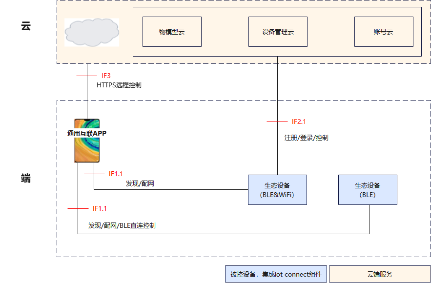

# IoT Connect组件

## 简介

IoT Connect组件是专为OpenHarmony资源受限的mini级设备所构建的一款极简、高性能的连接控制核心组件。其核心目标是为计算、存储和功耗均极为敏感的设备，提供稳定、安全且低功耗的设备接入、网络通信与远程控制能力。

通过抽象底层复杂的网络差异，IoT Connect组件极大地简化了物联网设备的开发流程，为构建轻量级智能硬件与实现万物互联的广泛接入提供了关键的技术基础支撑，是实现设备间智能协同与无缝连接的重要桥梁。

**核心功能：** 

- 多形态设备支持：面向 OpenHarmony mini级资源受限瘦设备，支持**BLE Only、BLE&WiFi Combo**等网络形态。
- 邻近发现与安全配网：提供设备邻近发现、安全配网及网络接入能力。
- 多模式控制：支持**BLE直连控制、端云控制**方式实现设备间端侧协同。

## 系统架构

统一互联是是一套完整、标准化的跨设备互联规范体系，解决不同品牌、不同品类、不同硬件规格设备无法互通、交互割裂的痛点，让智能设备用同一套 “语言” 通信、协作、共享能力。

在通用互联APP与设备、设备与云平台之间，定义并实现了一套完整的标准交互接口，如下图所示：

<div align="center">
  图 1 统一互联联动与控制组网图
  <br>
  
</div>

### 统一互联联动与控制组网图接口说明

<div align="center">
表1 统一互联联动与控制组网图接口说明
</div>

| **接口名称** | **通讯协议**                         | **接口说明**                                                                                 |
| -------- | -------------------------------- | ---------------------------------------------------------------------------------------- |
| IF1.1    | BLE Adv 广播<br>JSON Over BLE GATT | 通用互联APP与BLE设备通信接口，用于设备发现、连接、配网、BLE直连控制。                                                  |
| IF2.1    | Coap Over TLS <br>Coap Over TCP  | 资源不受限场景下WiFi设备与云端通信接口，用于设备注册、登录、控制，消息需要传输层加密。资源受限场景下WiFi设备与云端通信接口，用于设备注册、登录、控制，消息需要应用层加密 |
| IF3      | HTTPS MQTT                       | 通用互联APP与云端通信接口。云端向通用互联APP推送消息接口                                                          |

### IoT Connect组件架构

IoT Connect组件是统一互联的一个关键组件，集成在L0设备上，为设备提供互联互通的能力。

<div align="center">
  图2 IoT Connect组件架构图
  <br>
  
</div>

### 模块功能说明

整体架构划分为应用层、硬件适配层、内核。

#### 应用层

##### 厂商应用

业务上层应用，由设备厂商自主开发实现，直接调用 IoT Connect 组件对外暴露的标准化接口完成设备业务逻辑、业务数据处理。

##### IoT connect组件

组件整体分为**对外接口层、核心功能模块**两大分区，是连接厂商业务与底层硬件的中间核心，封装物联网设备连接、物模型、配网、事件全流程能力。

###### 接口层

用于向厂商应用提供标准化调用接口，包含部件运行、BLE Connect、WiFi Connect、设备管理接口能力。

- **部件运行**
  负责对外提供部件启动、复位、停止等部件运行相关接口以及部件运行参数配置接口。

- **设备管理**
  负责对外提供设备初始化、配置设备信息、注册物模型服务回调、服务主动上报等接口。

- **BLE Connect**
  负责对外提供使能基于BLE协议的设备发现、配网、控制的能力接口。

- **WiFi Connect**
  负责对外提供使能基于WiFi协议的设备注册、连接、控制的能力接口。

###### 核心功能

实现物联网核心业务逻辑，分为**部件运行管理、配置管理、物模型管理、设备控制、消息上报、设备发现连接、设备配网、设备注册、事件管理模块**9个功能模块。

- **部件运行管理**

负责组件线程的启动和退出控制、组件运行参数设置、组件恢复出厂。

- **配置管理**

管理厂商应用注册的设备信息、WiFi配置参数。

- **物模型管理**

产品的物模型包含多个服务，比如开关灯、亮度是两个服务。开关灯和设置灯光亮度是写指令（控制指令），获取灯的亮度是读指令。
物模型模块负责维护设备厂商应用注册的物模型服务、控制端发送指令合法性检查、透传控制模块发送的执行信息到设备厂商应用。

- **设备发现连接**

通过BLE服务发送无线广播，使得待配网的被控端设备能够被通用互联APP扫描发现。
用户操作通用互联 APP 连接被控设备，双方通过 PIN 码认证和 SPEKE 协商生成加密密钥，完成数据加密传输。

- **设备配网**

对于支持WiFi协议的硬件设备，使用BLE辅助配网。通用互联APP连上设备BLE后，向设备发送WiFi配网参数，设备连接上WiFi路由设备后，关闭BLE广播。

- **设备注册**

设备连接 WiFi 后，通过 CoAP 协议与云端建立连接，完成 PSK 协商认证、设备信息注册及设备登录。

- **设备控制**

控制端通过BLE直连、云端远程方式向控制端发送指令，被控端设备接收到指令后执行对应业务，包括读取信息、执行控制指令。

- **消息上报**

设备厂商应用通过组件提供的接口向云端、控制设备上报设备状态、设备事件等信息。

- **事件管理模块**

用于模块间的解耦通信，统一分发通知设备、BLE、WiFi服务的事件变化，处理定时任务、心跳保活、超时重传管理以及异步任务调度，避免阻塞业务流程。

#### 硬件层

IoT Connect 组件不直接操作硬件，通过两层标准化隔离实现芯片无关移植：

**轻量标准化 API（OpenHarmony 轻量子系统接口）**

- Bluetooth lite：OpenHarmony 标准蓝牙轻量化接口，定义 BLE 扫描、连接、数据收发等标准调用规范；
- WiFi lite API：OpenHarmony 标准 WiFi 轻量化接口，定义扫描、网络连接等标准调用规范。

**芯片厂商适配层**

由芯片厂商实现，对接对应芯片硬件驱动，为IoT Connect组件业务提供通信能力：

- BLE 接口适配：基于 Bluetooth lite的接口，适配芯片底层蓝牙驱动；
- WiFi 接口适配：基于 WiFi lite API，适配芯片 WiFi 驱动。

#### 内核

系统基础运行底座，上层硬件适配、IoT Connect 组件、厂商应用全部基于 LiteOS 内核调度运行。

### 关键交互流程

[详细介绍](docs/key_process_zh.md)

## 目录

```
//foundation/communication/iot_connect
├── adapter                 # 适配层代码（OS/BLE/WiFi）
├── core                    # 核心代码
│   ├── ble                 # BLE发现配网代码
│   ├── wifi                # WiFi发现配网及端云连接代码
│   ├── device              # 设备控制及注册信息管理代码
│   └── infrastructure      # 核心基础设施代码（安全/日志/事件等）
├── interfaces              # 对外接口代码
│   └ kits/common          # 通用接口定义（错误码/事件/配置等）
│   └ kits/oh_connect      # OpenHarmony对接接口
├── sdk                     # 解决方案业务入口代码
├── test                    # 测试代码
├── tools                   # 工具代码
└── docs                    # 文档目录
```

## 编译构建

### 编译宏变量说明

编译宏相关变量用于按需裁剪IoT Connect组件的功能与编译选项，开发者可根据产品实际场景，开启或关闭对应能力，在功能完整性与ROM/RAM资源占用之间取得平衡。

<div align="center">
表2 编译宏相关的变量说明
</div>

| 配置项 | 默认值 | 含义说明 |
| --- | --- | --- |
| `iot_connect_ble_support` | `true` | BLE能力。 |
| `iot_connect_sle_support` | `false` | SLE（星闪）能力。 |
| `iot_connect_wifi_support` | `false` | WiFi能力。 |
| `iot_connect_ailife_support` | `false` | AILife能力。|
| `iot_connect_mbedtls_v2_support` | `false` |  mbedtls v2 版本适配层。 |
| `iot_connect_mbedtls_psk_support` | `false` |  mbedtls TLS PSK（预共享密钥）密钥协商支持。 |
| `iot_connect_mbedtls_ccm_support` | `false` |  mbedtls AES-CCM 加解密算法。 |
| `iot_connect_ble_adv_update_support` | `false` | 发现广播数据的动态更新。 |
| `iot_connect_kv_support` | `true` |KV 持久化存储。 |
| `iot_connect_oh_nearlink_support` | `false` | OH 靠近发现广播控制。 |
| `iotc_connect_ble_net_cfg_support` | `false` |  BLE 配网能力。 |
| `iotc_connect_wifi_cloud_support` | `false` |  WiFi 端云能力。 |
| `iotc_connect_device_watch_dog_support` | `false` | 看门狗。 |
| `iot_connect_speke_not_support` | `false` |  关闭SPEKE安全协商。 |

### 裁剪指导

目前可按照以下场景和特性进行裁剪，后续会持续细化特性（比如安全、消息上报等）提供可裁剪能力，用户按需组合能力。

<div align="center">
表3 裁剪和内存信息
</div>

| 场景                  | 宏/gn 变量                                                                                                                                                                                                                          | ROM   | RAM    |
| ------------------- | -------------------------------------------------------------------------------------------------------------------------------------------------------------------------------------------------------------------------------- | ----- | ------ |
| BLE & WiFi Combo    | iot_connect_wifi_support设置为true，iot_connect_ble_support 设置为true，    IOTC_CONF_LOG_BUILD_LEVEL设置为 1                                                                                                                               | 130KB | 25KB   |
| BLE only            | iot_connect_wifi_support设置为false，   iot_connect_ble_support 设置为true，  IOTC_CONF_LOG_BUILD_LEVEL设置为1，  iot_connect_speke_not_support设置为true                                                                                                                              | 70KB  | 13KB   |
| BLE only 裁剪配网功能     | iot_connect_wifi_support设置为 false，  iotc_connect_wifi_cloud_support设置为false，  iot_connect_ble_support设置为true，  IOTC_CONF_LOG_BUILD_LEVEL设置为1，  iotc_connect_ble_net_cfg_support设置为false，  iot_connect_speke_not_support设置为true                                                     | 70KB  | 12.5KB |
| BLE only 裁剪配网功能和看门狗 | iot_connect_wifi_support设置为 false，  iotc_connect_wifi_cloud_support设置为false，  iot_connect_ble_support 设置为true，  IOTC_CONF_LOG_BUILD_LEVEL设置为 1，  iotc_connect_ble_net_cfg_support设为false，  iotc_connect_device_watch_dog设置为false，  iot_connect_speke_not_support设置为true| 70KB  | 11.5KB |

### 编译

根据不同的目标平台，使用以下命令进行编译：

**编译32位ARM系统iot_connect部件**

```bash
bash build/prebuilts_download.sh           #预编译
hb set      #选择mini, 再继续选择对应产品，比如dk_3863
hb build                                     #编译
```

## 使用说明

### IoT Connect组件接口说明

#### 部件运行

| 函数原型                                          | 核心功能说明                                                   |
| --------------------------------------------- | -------------------------------------------------------- |
| int32_t IotcOhMain(void)                      | 部件业务入口，调用后拉起自身任务线程，大部分预配置类接口不再可用                         |
| int32_t IotcOhReset(void)                     | 部件复位，调用后部件会重置所有组件业务的运行状态，仅在部件运行时有效，该接口为同步接口，返回即表示复位成功/失败 |
| int32_t IotcOhStop(void)                      | 停止部件的运行，仅在部件运行时有效，该接口为同步接口，返回即表示停止成功/失败                  |
| int32_t IotcOhRestore(void)                   | 通知所有业务恢复出厂，仅在部件运行时有效，该接口为同步接口，返回即表示恢复出厂成功/失败             |
| int32_t IotcOhSetOption(int32_t option, ...); | 配置部件运行时的参数，option为待配置的参数类型，需结合对应配置选项使用                   |

#### BLE Connect

| 函数原型                                                                                                                  | 核心功能说明                                                                                                                     |
| --------------------------------------------------------------------------------------------------------------------- | -------------------------------------------------------------------------------------------------------------------------- |
| int32_t IotcOhBleEnable(void)                                                                                         | 使能BLE发现、连接、控制的能力，该接口仅做使能，调用不会触发任何业务流程，应在iot connect运行前调用                                                                   |
| int32_t IotcOhBleDisable(void)                                                                                        | 关闭iot connect的BLE发现、连接、控制的能力，用于释放调用IotcOhBleEnable时申请的资源，无法在iot connect运行时调用                                               |
| int32_t IotcOhBleStartAdv(uint32_t ms);                                                                               | 启动BLE广播发现，根据初始化参数的不同，iot connect启动后会自动发送一段时间广播，后续需调用该接口激活广播，用于配合外部按键实现按键触发场景；ms为广播时长（单位ms），gatt的连接不会刷新、延长该时间               |
| int32_t IotcOhBleStopAdv(void)                                                                                        | 在BLE广播发现期间，调用该接口可以停止广播                                                                                                     |
| int32_t IotcOhBleSendCustomSecData(const uint8_t *data, uint32_t len);                                                | 部分场景下，用于通过customSecData服务通道发送数据，sdk完成数据加密后发送给对端；data为待发送数据，len为数据长度                                                        |
| int32_t IotcOhBleSendIndicateData(const char *svcUuid, const char *charUuid, const uint8_t *value, uint32_t valueLen) | 当使用部件管理GATT服务时，用于发送BLE Indicate数据；svcUuid为Ble gatt svc uuid，charUuid为Ble gatt svc character UUID，value为待发送数据，valueLen为数据长度 |
| int32_t IotcOhBleRelease(void)                                                                                        | BLE资源释放，用于释放调用IotcOhBleEnable时申请的资源，该接口在iot connect运行时调用                                                                   |

#### WiFi Connect

| 函数原型                            | 核心功能说明                                                                         |
| ------------------------------- | ------------------------------------------------------------------------------ |
| int32_t IotcOhWifiEnable(void)  | 使能基于WiFi/LAN的发现、连接、控制的能力，该接口仅做使能，调用不会触发任何业务流程，应在iot connect运行前调用               |
| int32_t IotcOhWifiDisable(void) | 关闭iot connect的WiFi发现、连接、控制的能力，用于释放调用IotcOhWifiEnable时申请的资源，无法在iot connect运行时调用 |

#### 设备管理

| 函数原型                                                                        | 核心功能说明                                                                                 |
| --------------------------------------------------------------------------- | -------------------------------------------------------------------------------------- |
| int32_t IotcOhDevInit(void)                                                 | 配置设备信息，并注册设备服务/控制等相关业务回调，该接口应在iot connect运行前调用                                         |
| int32_t IotcOhDevDeinit(void)                                               | 释放调用IotcOhDevInit时申请的资源，该接口无法在iot connect运行时调用                                         |
| int32_t IotcOhDevReportCharState(const IotcCharState state[], uint32_t num) | 上报设备的服务信息，应在设备的服务信息发生变化/事件服务发生时调用；state为上报服务列表（应为常量指针，详见IotcCharState结构体定义），num为上报服务数量 |

### 南向接口

IoT Connect调用Openharmony轻量级Bluetooth和WiFi子系统的标准接口，接口由芯片模组厂商实现。

轻量级Bluetooth：[轻量级Bluetooth系统使用说明](https://gitcode.com/ohos-oneconnect/communication_bluetooth#%E8%BD%BB%E9%87%8F%E6%88%96%E5%B0%8F%E5%9E%8B%E7%B3%BB%E7%BB%9F%E4%BD%BF%E7%94%A8%E8%AF%B4%E6%98%8E)

轻量级WiFi：[轻量级wifi系统使用说明](https://gitcode.com/ohos-oneconnect/communication_wifi_lite)

以下为IoT Connect依赖的接口： 

#### BLE接口

| 函数原型                                                                                | 核心功能说明         |
| ----------------------------------------------------------------------------------- | -------------- |
| int InitBtStack(void)                                                               | 初始化蓝牙协议栈       |
| int EnableBtStack(void)                                                             | 使能蓝牙协议栈        |
| int DisableBtStack(void)                                                            | 去使能蓝牙协议栈       |
| int SetDeviceName(const char *name, unsigned int len)                               | 设置蓝牙设备名称       |
| int ReadBtMacAddr(unsigned char *mac, unsigned int len)                             | 读取蓝牙MAC地址      |
| int BleGattsRegisterCallbacks(BtGattServerCallbacks *func)                          | 注册GATT服务器回调    |
| int BleGattRegisterCallbacks(BtGattCallbacks *func)                                 | 注册GATT客户端回调    |
| int BleGattsStartServiceEx(int *srvcHandle, BleGattService *srvcInfo)               | 启动GATT服务       |
| int BleGattsDeleteService(int serverId, int srvcHandle)                             | 删除GATT服务       |
| int BleGattsUnRegister(int serverId)                                                | 注销GATT服务器      |
| int BleGattsSendIndication(int serverId, GattsSendIndParam *param)                  | 发送Indication通知 |
| int BleGattsDisconnect(int serverId, BdAddr bdAddr, int connId)                     | 断开GATT连接       |
| int BleGattsSetEncryption(BdAddr bdAddr, BleSecAct secAct)                          | 设置连接加密类型       |
| int BleStartAdvEx(int *advId, const StartAdvRawData rawData, BleAdvParams advParam) | 启动BLE广播        |
| int BleStopAdv(int advId)                                                           | 停止BLE广播        |
| int BleSetSecurityAuthReq(BleAuthReqMode mode)                                      | 蓝牙安全认证设置       |
| int BleGattSecurityRsp(BdAddr bdAddr, bool accept)                                  | 安全响应           |

#### WiFi接口

| 函数原型                                                           | 核心功能说明        |
| -------------------------------------------------------------- | ------------- |
| int EnableWifi()                                               | 启用WiFi        |
| int DisableWifi()                                              | 禁用WiFi        |
| int IsWifiActive()                                             | 检查WiFi是否启用    |
| int GetDeviceConfigs(WifiDeviceConfig *config, uint32_t *size) | 获取WiFi配置信息    |
| int AddDeviceConfig(WifiDeviceConfig *config, int *netId)      | 添加WiFi网络配置    |
| int RemoveDevice(int netId)                                    | 移除WiFi网络配置    |
| int ConnectTo(int networkId)                                   | 连接指定网络ID的WiFi |
| int Disconnect()                                               | 断开WiFi连接      |
| int AdvanceScan(const WifiScanParams *params)                  | 开始WiFi扫描      |
| int GetScanInfoList(WifiScanInfo *result, uint32_t *size)      | 获取扫描结果列表      |
| int GetLinkedInfo(WifiLinkedInfo *info)                        | 获取当前WiFi连接信息  |
| int RegisterWifiEvent(const WifiEvent *event)                  | 注册WiFi事件回调    |
| int IsHotspotActive()                                          | 检查热点是否启用      |
| int EnableHotspot()                                            | 启用热点          |
| int DisableHotspot()                                           | 禁用热点          |
| int SetHotspotConfig(const HotspotConfig *config)              | 配置热点参数        |
| int GetStationList(StationInfo *info, uint32_t *size)          | 获取已连接STA信息    |
| int DisassociateSta(unsigned char *mac, int lenMac)            | 强制断开指定STA连接   |
| int AddTxPowerInfo(int power)                                  | 设置热点发送功率      |
| int GetDeviceMacAddress(unsigned char *result)                 | 获取设备mac地址     |
| int GetIpInfo(IpInfo &info)                                    | 获取ip信息        |

### 开发步骤

**说明：** 以下演示介绍开发 IoT Connect 的完整流程，包含控制端APP安装部署，云平台部署，被控能力使能、配置参数、设备发现、数据交互及资源释放（以BLE/WiFi Combo为示例代码）。

#### 主控端

主控端负责APP安装部署，云平台部署，云端通信及控制指令下发。

| 项目                   | 说明                      | 链接                                                                                              |
| -------------------- | ----------------------- | ----------------------------------------------------------------------------------------------- |
| 通用互联APP              | 控制核心入口，运行在HOS手机上        | [通用互联APP](https://gitcode.com/ohos-oneconnect/docs/blob/master/zh-cn/设备联动与控制/通用互联APP/README.md) |
| IoTManagementService | OpenHarmony设备上的设备管理服务组件 | [IoTManagementService](https://gitcode.com/ohos-oneconnect/IoTManagementService)                |

#### 云平台

| 项目  | 说明                    | 链接                                                                                      |
| --- | --------------------- | --------------------------------------------------------------------------------------- |
| 云平台 | 互联互通云端服务，提供账号、设备、场景管理 | [云平台](https://gitcode.com/ohos-oneconnect/docs/blob/master/zh-cn/设备联动与控制/云平台/README.md) |

#### 被控端

被控端需集成 IoT Connect 组件，实现设备信息配置、控制回调处理、认证回调注册等功能。

| 平台     | 套餐类型           | 开发指南                                                        |
| ------ | -------------- | ----------------------------------------------------------- |
| Hi3863 | BLE only       | [ble_only_hi3863.md](./docs/ble_only_hi3863.md)             |
| Hi3863 | WiFi/BLE Combo | [wifi_ble_combo_hi3863.md](./docs/wifi_ble_combo_hi3863.md) |

#### IoT Connect组件使用示例

**示例1：BLE Only 点对点控制**

设备通过BLE广播被APP发现，APP连接设备后下发控制指令（如开灯/关灯），设备执行并上报状态。

**开发步骤**

1. **配置设备基础信息**：配置如产品ID、厂商ID等基础信息；

2. **映射物模型服务**：如switch等服务；

3. **实现控制回调**：如控制指令接收、状态查询等；

4. **实现认证回调方法**：配网鉴权处理；

5. **启动组件**：使能各模块能力，启动组件；

6. **事件监听**：监听蓝牙广播等事件。

**步骤1：配置设备基础信息**

```c
#include "iotc_oh_device.h"
#include "iotc_oh_ble.h"
#include "iotc_prof_def.h"

// 设备信息（需与云平台注册信息一致）
static const IotcDeviceInfo DEV_INFO = {
    .sn = "FFEE3333",          // 设备序列号
    .prodId = "00007",         // 产品ID
    .subProdId = "",           // 子产品ID
    .model = "PD31",           // 设备型号
    .devTypeId = "1007",       // 设备类型ID
    .devTypeName = "TabletPD31",
    .manuId = "104",           // 厂商ID
    .manuName = "OpenValley",
    .devName = "OneConnectName",
    .fwv = "1.0.0",
    .hwv = "1.0.0",
    .swv = "1.0.0",
    .protType = IOTC_PROT_TYPE_BLE,  // BLE单模
};

// 配网PIN码（APP配网时输入）
static const char *PIN_CODE = "01234567";
```

**步骤2：映射物模型服务**

```c
// 定义服务列表（必须与云平台物模型一致）
static const IotcServiceInfo SVC_INFO[] = {
    {"switch", "switch"},    // 开关服务
};

// 服务处理函数映射表
typedef int32_t (*PutCharStateFunc)(const IotcServiceInfo *svc, const char *data, uint32_t len);
typedef int32_t (*GetCharStateFunc)(const IotcServiceInfo *svc, char **data, uint32_t *len);

typedef struct {
    const IotcServiceInfo *svc;
    PutCharStateFunc putCharState;
    GetCharStateFunc getCharState;
} SvcMapEntry;

// 注册开关服务的处理函数
SvcMapEntry g_svcMap[] = {
    {&SVC_INFO[0], SwitchPutCharState, SwitchGetCharState},
};
```

**步骤3：实现控制回调**

```c
// 全局状态变量
static bool g_switch = false;  // false=关灯, true=开灯

// 1. 控制指令接收（APP下发指令时调用）
int32_t SwitchPutCharState(const IotcServiceInfo *svc, const char *data, uint32_t len)
{
    (void)svc;
    if (data == NULL || len == 0) { return -1; }

    // 解析JSON: {"on":1} 或 {"on":0}
    cJSON *json = cJSON_Parse(data);
    if (json == NULL) { return -1; }

    cJSON *item = cJSON_GetObjectItem(json, "on");
    if (item == NULL || !cJSON_IsNumber(item)) {
        cJSON_Delete(json);
        return -1;
    }

    int32_t on = cJSON_GetNumberValue(item);
    g_switch = (on == 1);

    // 控制GPIO（示例：GPIO5输出高/低电平）
    IoTGpioSetOutputVal(LED_GPIO, g_switch ? 1 : 0);

    cJSON_Delete(json);
    return 0;
}

// 2. 状态查询（APP查询状态时调用）
int32_t SwitchGetCharState(const IotcServiceInfo *svc, char **data, uint32_t *len)
{
    (void)svc;
    if (data == NULL || *data != NULL) { return -1; }

    // 构建JSON: {"on":0} 或 {"on":1}
    cJSON *json = cJSON_CreateObject();
    if (json == NULL) { return -1; }

    cJSON_AddNumberToObject(json, "on", g_switch ? 1 : 0);
    *data = cJSON_PrintUnformatted(json);
    *len = strlen(*data);

    cJSON_Delete(json);
    return (*data != NULL) ? 0 : -1;
}

// 3. 全量状态上报（设备上线时调用）
int32_t ReportAll(void)
{
    // 获取开关服务状态
    char *jsonStr = NULL;
    uint32_t jsonLen = 0;
    SwitchGetCharState(&SVC_INFO[0], &jsonStr, &jsonLen);

    IotcCharState states[1] = {0};
    states[0].svcId = "switch";
    states[0].data = jsonStr;
    states[0].len = jsonLen;

    int32_t ret = IotcOhDevReportCharState(states, 1);
    cJSON_free(jsonStr);
    return ret;
}
```

**步骤4：实现认证回调方法**

```c
// PIN码获取（配网鉴权）
int32_t GetPincode(uint8_t *buf, uint32_t bufLen)
{
    if (buf == NULL || bufLen < IOTC_PINCODE_LEN) { return -1; }
    (void)memcpy_s(buf, bufLen, PIN_CODE, IOTC_PINCODE_LEN);
    return 0;
}

// 内存释放回调
void DataFree(void *ptr)
{
    if (ptr != NULL) { cJSON_free((char *)ptr); }
}
```

**步骤5：启动组件（入口函数）**

```c
int32_t IotcOhDemoEntry(void)
{
    int32_t ret;

    // 1. 初始化设备管理模块（必须首先调用）
    ret = IotcOhDevInit();
    if (ret != 0) { return ret; }

    // 2. 使能BLE模块
    ret = IotcOhBleEnable();
    if (ret != 0) { return ret; }

    // 3. 注册控制回调
    SET_OH_SDK_OPTION(ret, IOTC_OH_OPTION_DEVICE_PUT_CHAR_STATE_CALLBACK, PutCharState);
    SET_OH_SDK_OPTION(ret, IOTC_OH_OPTION_DEVICE_GET_CHAR_STATE_CALLBACK, GetCharState);
    SET_OH_SDK_OPTION(ret, IOTC_OH_OPTION_DEVICE_REPORT_ALL_CALLBACK, ReportAll);
    SET_OH_SDK_OPTION(ret, IOTC_OH_OPTION_DEVICE_GET_PINCODE_CALLBACK, GetPincode);
    SET_OH_SDK_OPTION(ret, IOTC_OH_OPTION_DEVICE_GET_AC_KEY_CALLBACK, GetAcKey);
    SET_OH_SDK_OPTION(ret, IOTC_OH_OPTION_DEVICE_DATA_FREE_CALLBACK, DataFree);

    // 4. 配置设备和服务信息
    SET_OH_SDK_OPTION(ret, IOTC_OH_OPTION_DEVICE_DEV_INFO, &DEV_INFO);
    SET_OH_SDK_OPTION(ret, IOTC_OH_OPTION_DEVICE_SVC_INFO, SVC_INFO, 1);

    // 5. 配置BLE广播参数（永不超时）
    SET_OH_SDK_OPTION(ret, IOTC_OH_OPTION_BLE_START_UP_ADV_TIMEOUT, (1000 * 60 * 1000));

    // 6. 注册事件监听
    SET_OH_SDK_OPTION(ret, IOTC_OH_OPTION_SDK_CONFIG_PATH, "/data/app/iotc");
    SET_OH_SDK_OPTION(ret, IOTC_OH_OPTION_SDK_REG_EVENT_LISTENER, DemoEventListener);

    // 7. 启动组件（启动后不可再调用配置接口）
    ret = IotcOhMain();
    return ret;
}
```

**步骤6：事件监听**

```c
void DemoEventListener(int32_t event)
{
    switch (event) {
        case IOTC_CORE_COMM_EVENT_MAIN_INITIALIZED:      // 组件初始化完成
        case IOTC_CORE_BLE_EVENT_GATT_DISCONNECT:       // 连接断开
            IotcOhBleStartAdv(0);  // 重启广播
            break;
        default:
            break;
    }
}
```

**示例2：BLE&WiFi Combo 配网控制**

设备同时支持BLE和WiFi，BLE用于辅助配网，WiFi用于连接云端和APP控制。

**若开发BLE&WiFi Combo 模式，注意与BLE Only的差异**

```c
// Combo设备信息
static const IotcDeviceInfo DEV_INFO = {
    // ...
    .protType = IOTC_PROT_TYPE_BLE_AND_WIFI,  // BLE+WiFi双模
};

// 1. 同时使能BLE和WiFi
ret = IotcOhBleEnable();
ret = IotcOhWifiEnable();

// 2. 配置BLE辅助配网
SET_OH_SDK_OPTION(ret, IOTC_OH_OPTION_WIFI_NETCFG_MODE, IOTC_NET_CONFIG_MODE_BLE_SUP);
SET_OH_SDK_OPTION(ret, IOTC_OH_OPTION_WIFI_NETCFG_TIMEOUT, (24 * 60 * 60 * 1000));

// 3. 配置BLE广播参数
SET_OH_SDK_OPTION(ret, IOTC_OH_OPTION_BLE_START_UP_ADV_TIMEOUT, (1000 * 60 * 1000));
```

#### 注意事项

- **模块调用顺序**：必须先调用各能力模块的使能接口（IotcOhBleEnable、IotcOhWifiEnable、IotcOhDevInit），再调用IotcOhMain启动部件业务；释放资源时，需先调用IotcOhStop停止部件，再依次释放各模块资源。

- **配置项要求**：设备管理模块的配置项为必需配置，未配置会导致部件启动失败；配置时需确保设备信息（如prodId、devTypeId）与云端定义严格一致。

- **广播与配网**：BLE广播时长可通过IOTC_OH_OPTION_BLE_START_UP_ADV_TIMEOUT配置（单位ms），GATT连接不会延长广播时间；WiFi配网模式需根据设备能力选择，BLE辅助配网需确保BLE能力已使能。

- **数据交互限制**：IotcOhBleSendCustomSecData接口会对数据进行加密后发送，需确保待发送数据指针有效、长度合法；发送Indicate数据时，需正确传入GATT服务UUID和特征UUID。

- **回调线程限制**：所有注册的回调函数（如配网回调、数据接收回调）运行在非UI线程，请勿在回调中执行耗时操作，避免阻塞业务流程。

- **资源释放规范**：调用IotcOhBleRelease释放BLE资源时，需确保在部件运行时调用；IotcOhDevDeinit、IotcOhWifiDisable需在部件停止后调用，否则会返回失败。

## 配套资料

### 技术标准

| 标准                                                             |
| -------------------------------------------------------------- |
| [《物模型技术标准》](https://www.giiconsortium.org/2025/post/2502/)     |
| [《接入与控制接口技术标准》](https://www.giiconsortium.org/2025/post/2506/) |

### Release版本说明

| 版本                        | 链接                                                                                                                                                           |
| ------------------------- | ------------------------------------------------------------------------------------------------------------------------------------------------------------ |
| OneConnect v2.0.0 Release | [OpenHarmony OneConnect-v2.0.0-release](https://gitcode.com/ohos-oneconnect/docs/blob/master/zh-cn/release-notes/OpenHarmony%20OneConnect-v2.0.0-release.md) |

## 相关仓

[communication_wifi_lite](https://gitcode.com/openharmony/communication_wifi_lite)

[communication_bluetooth](https://gitcode.com/openharmony/communication_bluetooth)